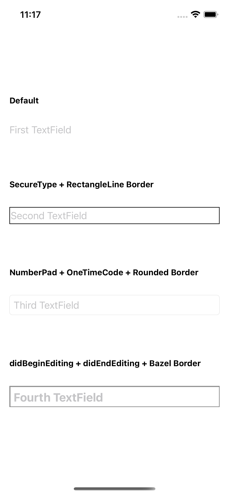

[](https://developer.apple.com/swift)


[](https://github.com/aaronLab/SweetCardScanner/blob/main/LICENSE)

# RespondableTextField

`RespondableTextField` is a simple textField library for SwiftUI. The reason why I wanted to make this library was because I was too lazy to make `UIViewRepresentable`views every single time. Also, I know you were really struggling from, or tired of taking care of UITextFieldDelegate methods, such as `becomeFirstResponder`, `resignFirstResponder`. I really hope this helps you.



## Requirements

- iOS 13.0+ (due to SwiftUI)

## Installation

- In Xcode, add the URL of this repository in SwiftPM:

  ```http
  https://github.com/aaronLab/RespondableTextField
  ```

## Usage

- `import RespondableTextField`
- Add `RespondableTextField` in your body like below.
- **_⚠️To make it work properly: The tags of each RespondableTextField in each body must be increased SEQUENTIALLY in order.⚠️_**

  ```Swift
  RespondableTextField(
      tag: Int,
      placeholder: String?,
      onEditing: ((String) -> Void)?,
      onCommitted: (() -> Void)?,
      didBeginEditing: (() -> Void)?,
      didEndEditing: ((UITextField.DidEndEditingReason) -> Void)?
  )
  ```

- Also, you don't have to fill all of the optional parameters.

## Example

You can use or customize RespondableTextField like below, or [see example file](./Example/Example/ContentView.swift).

```Swift
//
//  ContentView.swift
//  Example
//
//  Created by Aaron Lee on 2020-12-17.
//

import SwiftUI
import RespondableTextField

struct ContentView: View {
    // MARK: - PROPERTIES

    @State private var text1: String = ""
    @State private var text2: String = ""
    @State private var text3: String = ""
    @State private var text4: String = ""

    // MARK: - BODY

    var body: some View {
        VStack(alignment: .leading, spacing: 30) {

            // Default
            Group {
                Text("Default")
                    .font(.system(size: 14, weight: .bold, design: .default))
                RespondableTextField(tag: 0, placeholder: "First TextField") { value in
                    self.text1 = value
                } onCommitted: {
                    print(self.text1)
                }
                Text(text1)
            }

            // SecureType + RectangleLine Border
            Group {
                Text("SecureType + RectangleLine Border")
                    .font(.system(size: 14, weight: .bold, design: .default))
                RespondableTextField(tag: 1, placeholder: "Second TextField") { value in
                    self.text2 = value
                }
                .respondableSecureType()
                .respondableLineStyle()

                Text(text2)
            }

            // NumberPad + OneTimeCode + Rounded Border
            Group {
                Text("NumberPad + OneTimeCode + Rounded Border")
                    .font(.system(size: 14, weight: .bold, design: .default))
                RespondableTextField(tag: 2, placeholder: "Third TextField") { value in
                    self.text3 = value
                } onCommitted: {
                    print(self.text3)
                }
                .respondableKeyboardType(.numberPad)
                .respondableContentType(.oneTimeCode)
                .textFieldStyle(RoundedBorderTextFieldStyle())

                Text(text3)
            }

            // didBeginEditing + didEndEditing + Bazel Border + Font
            Group {
                Text("didBeginEditing + didEndEditing + Bazel Border")
                    .font(.system(size: 14, weight: .bold, design: .default))
                RespondableTextField(tag: 3, placeholder: "Fourth TextField") { value in
                    self.text4 = value
                } didBeginEditing: {
                    print("Begin")
                } didEndEditing: { _ in
                    print("Done")
                }
                .respondableBezelStyle()
                .respondableFont(.systemFont(ofSize: 20, weight: .bold))
            }

        } //: V
        .padding()

    }
}

struct ContentView_Previews: PreviewProvider {
    static var previews: some View {
        ContentView()
    }
}

```

## License

Licensed under [MIT](./LICENSE)
